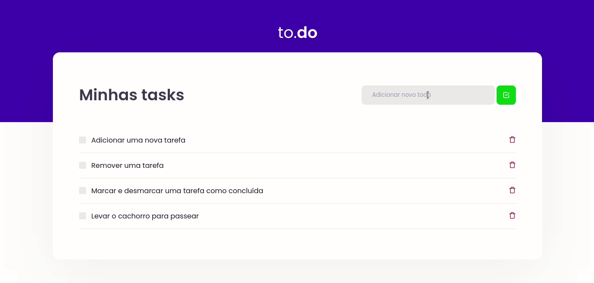

# Desafio 01 - Conceitos do React

## Objetivo

Criar um To do List para consolidar o que foi estudado com React que deverá contar com as seguintes funcionalidades:

:heavy_check_mark: Adicionar uma nova tarefa

:heavy_check_mark: Remover uma tarefa

:heavy_check_mark: Marcar e desmarcar uma tarefa como concluída

Esse projeto foi criado através do template [ignite-template-reactjs-conceitos-do-react
](https://github.com/rocketseat-education/ignite-template-reactjs-conceitos-do-react)

## Resultados

<div align="center">
    
</div>
<br><br>

Em [components/TaskList.tsx]() encontramos as funções principais da aplicação que são as seguintes:
* **Adicionar uma nova tarefa:** 
``` typescript
function handleCreateNewTask() {
    if (!newTaskTitle) return;

    const newTask = {
        id: Math.random(),
        title: newTaskTitle,
        isComplete: false,
    };

    setTasks((oldTasks) => [...oldTasks, newTask]);
    setNewTaskTitle("");
}
```

* **Remover uma tarefa:**
 ``` typescript
function handleRemoveTask(id: number) {
    const otherTasks = tasks.filter((task) => task.id !== id);
    setTasks(otherTasks);
}
 ```

* **Marcar e desmarcar uma tarefa como concluída:** 
 ``` typescript
function handleToggleTaskCompletion(id: number) {
    const newTasks = tasks.map((task) =>
        task.id === id
        ? {
            ...task,
            isComplete: !task.isComplete,
        }
        : task
    );
}
 ```

## Como rodar o projeto?

1. Faça download do projeto
2. Entre no diretório do projeto pelo terminal
3. Rode os comandos : `yarn` e `yarn dev`
4. Acesse http://localhost:8080/ 

<hr>

<div align="center">
    Made with ☕ & &#128156; by <strong>Eirene</strong>
</div>


